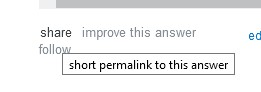

# require_so

**Copying** code from StackOverflow? In **my** DRY codebase? Not if *I* can help it!


```
$ cat dry.rb
require "require_so"
require_so "https://stackoverflow.com/a/61879644"

puts fast_next_smaller(907)
$ ruby dry.rb
790
```

## Usage

1. Require `require_so`

```ruby
require "require_so"
```

2. Copy the **share** link below your StackOverflow answer



3. Paste it into your code

```ruby
require_so "https://stackoverflow.com/a/61877826"
```

You can also specify the index of the snippet you want to require

```ruby
require_so "https://stackoverflow.com/a/61877826", 1 # will require the 2nd code snippet in the post
```

4. Achieve DRYness
